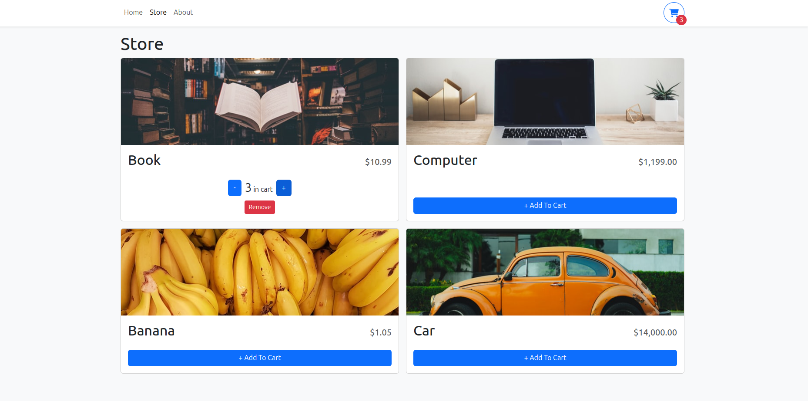
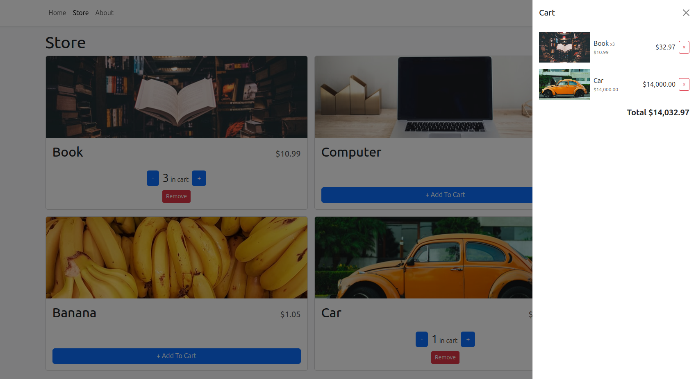

# Advanced Shopping Cart

This project is a frontend-only advanced shopping cart built with React, TypeScript, and Vite. It is based on a YouTube tutorial titled **"How To Create An Advanced Shopping Cart With React and TypeScript"** by Web Dev Simplified. You can watch the tutorial [here](https://www.youtube.com/watch?v=lATafp15HWA&t=26s).

## Project Overview

The Advanced Shopping Cart demonstrates how to create a shopping cart interface where users can:

-   Browse a store page that displays a list of products.
-   Add products to their cart.
-   Increase, decrease, or remove products from their cart.
-   View their cart through a sidebar that pops up from the side of the page.
-   Persist cart data using local storage.

The data used in this project is populated from a JSON file.

## Tech Stack

-   **React**: A JavaScript library for building user interfaces.
-   **TypeScript**: A statically typed superset of JavaScript that adds types to the language.
-   **Vite**: A fast build tool that serves as a development server for modern web projects.
-   **React Context**: A way to manage and share state across components without passing props.
-   **React Router**: A standard library for routing in React.
-   **React Bootstrap**: A popular front-end framework for building responsive, mobile-first sites using Bootstrap components in React.

## Project Structure

This project demonstrates a well-structured folder organization, ensuring clean and maintainable code. The main directories are:

-   `src/components`: Contains reusable React components.
-   `src/context`: Manages the global state using React Context.
-   `src/pages`: Contains the main pages of the application, such as the Store page.
-   `src/hooks`: Contains custom hooks used within the project.
-   `src/utils`: Contains utility functions.
-   `src/data`: Contains the JSON file with product data.

## Installation and Setup

To get started with the project, follow these steps:

1.  **Clone the repository**:
    
    bash
    
    Copy code
    
    `git clone https://github.com/yourusername/advance-shopping-cart.git
    cd advance-shopping-cart` 
    
2.  **Install dependencies**:
    
    bash
    
    Copy code
    
    `npm install` 
    
3.  **Run the development server**:
    
    bash
    
    Copy code
    
    `npm run dev` 
    
    The app will be available at `http://localhost:5173`.
    
4.  **Build the project**:
    
    bash
    
    Copy code
    
    `npm run build` 
    
    The production-ready build will be in the `dist/` directory.
    
5.  **Preview the build**:
    
    bash
    
    Copy code
    
    `npm run preview` 
    
6.  **Lint the code**:
    
    bash
    
    Copy code
    
    `npm run lint` 
    

## ESLint Configuration

This project uses ESLint for code linting with the following configuration:

-   **@vitejs/plugin-react** is used for Fast Refresh with Babel.
-   **typescript-eslint** is configured to enable type-aware lint rules, ensuring type safety.
-   **eslint-plugin-react** is installed and configured to use React-specific linting rules.

To extend the ESLint configuration for a production application, you can:

1.  Update the `parserOptions` in your ESLint config:
    
    javascript
    
    Copy code
    
    `export default tseslint.config({
      languageOptions: {
        parserOptions: {
          project: ['./tsconfig.node.json', './tsconfig.app.json'],
          tsconfigRootDir: import.meta.dirname,
        },
      },
    });` 
    
2.  Replace `tseslint.configs.recommended` with `tseslint.configs.recommendedTypeChecked` or `tseslint.configs.strictTypeChecked`.
    
3.  Optionally, add `...tseslint.configs.stylisticTypeChecked` for stylistic rules.
    
4.  Install `eslint-plugin-react` and update the ESLint configuration:
    
    javascript
    
    Copy code
    
    `import react from 'eslint-plugin-react';
    
    export default tseslint.config({
      settings: { react: { version: '18.3' } },
      plugins: {
        react,
      },
      rules: {
        ...react.configs.recommended.rules,
        ...react.configs['jsx-runtime'].rules,
      },
    });` 
    

## Additional Features

-   **Local Storage**: The project demonstrates how to use local storage to persist cart items even when the page is refreshed.
-   **Responsive Design**: The application is designed to be responsive and works well on various screen sizes.

## License

This project is licensed under the MIT License. See the LICENSE file for more details.

> Written with [StackEdit](https://stackedit.io/).
